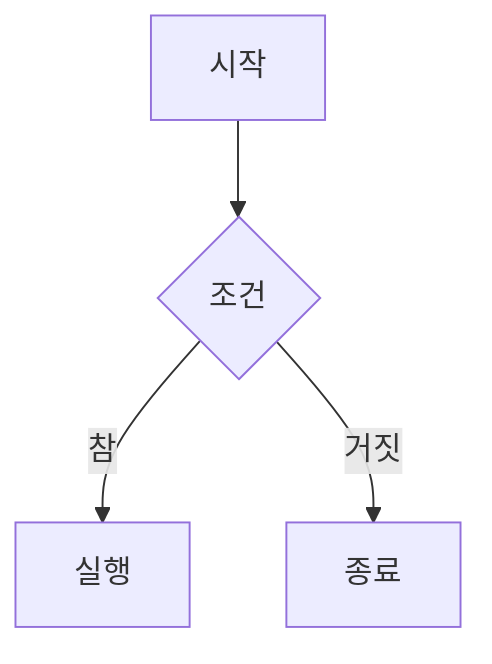

# 마크다운 완벽 가이드: 기초부터 활용까지

마크다운(Markdown)은 텍스트 기반의 마크업 언어로, 누구나 쉽게 읽고 쓸 수 있는 서식 있는 문서를 만들 수 있습니다. 개발자뿐만 아니라 블로거, 학생, 기술 문서 작성자까지 다양한 분야에서 활용되고 있습니다. 이 글에서는 마크다운의 기초 문법부터 실전 활용 팁까지 빠짐없이 다루겠습니다.

## 마크다운이란?

마크다운은 2004년 존 그루버(John Gruber)와 아론 스워츠(Aaron Swartz)가 만든 경량 마크업 언어입니다. HTML을 모르더라도 간단한 기호만으로 서식이 적용된 문서를 작성할 수 있다는 것이 가장 큰 장점입니다.

### 마크다운의 장점

- **배우기 쉽다**: 기본 문법을 익히는 데 30분이면 충분합니다.
- **어디서나 쓸 수 있다**: 메모장부터 전문 에디터까지 어떤 텍스트 편집기에서든 작성 가능합니다.
- **플랫폼 독립적이다**: `.md` 파일은 어떤 운영체제에서든 열 수 있습니다.
- **버전 관리에 유리하다**: Git 같은 버전 관리 시스템과 궁합이 좋습니다.
- **다양한 형식으로 변환 가능하다**: HTML, PDF, Word 등으로 쉽게 변환할 수 있습니다.

## 기본 문법

### 제목 (Headings)

제목은 `#` 기호를 사용합니다. `#`의 개수에 따라 제목의 수준이 달라집니다.

```markdown
# 제목 1 (h1)
## 제목 2 (h2)
### 제목 3 (h3)
#### 제목 4 (h4)
##### 제목 5 (h5)
###### 제목 6 (h6)
```

일반적으로 문서 하나에 `#`(h1)은 한 번만 사용하고, 본문의 섹션에는 `##`(h2)부터 사용하는 것이 좋습니다.

### 텍스트 강조

텍스트에 다양한 강조 효과를 줄 수 있습니다.

```markdown
**굵게 (Bold)**
*기울임 (Italic)*
***굵게 + 기울임***
~~취소선 (Strikethrough)~~
`인라인 코드`
```

결과:

- **굵게 (Bold)**
- *기울임 (Italic)*
- ***굵게 + 기울임***
- ~~취소선 (Strikethrough)~~
- `인라인 코드`

### 목록 (Lists)

순서가 없는 목록과 순서가 있는 목록 모두 지원합니다.

```markdown
순서 없는 목록:
- 항목 1
- 항목 2
  - 하위 항목 2-1
  - 하위 항목 2-2
- 항목 3

순서 있는 목록:
1. 첫 번째
2. 두 번째
3. 세 번째
```

순서 없는 목록에는 `-`, `*`, `+` 기호를 사용할 수 있습니다. 들여쓰기를 통해 중첩 목록도 만들 수 있습니다.

### 링크 (Links)

```markdown
[링크 텍스트](https://example.com)
[링크 텍스트](https://example.com "마우스 올리면 보이는 제목")

<!-- 참조 스타일 -->
[링크 텍스트][참조]
[참조]: https://example.com
```

예시: [printmd 공식 사이트](https://printmd.app)처럼 자연스럽게 본문에 녹여서 사용합니다.

### 이미지 (Images)

이미지는 링크 문법 앞에 `!`를 붙입니다.

```markdown


```

대체 텍스트(alt text)는 이미지를 표시할 수 없을 때 보여지며, 접근성과 SEO에도 중요합니다.

### 코드 블록 (Code Blocks)

인라인 코드는 백틱(`` ` ``)으로 감싸고, 여러 줄의 코드 블록은 백틱 세 개로 감쌉니다.

````markdown
인라인: `console.log('hello')`

코드 블록:
```javascript
function greet(name) {
  return `안녕하세요, ${name}님!`;
}
```
````

언어를 지정하면 구문 강조(syntax highlighting)가 적용됩니다. `javascript`, `python`, `html`, `css`, `bash` 등 다양한 언어를 지원합니다.

### 인용문 (Blockquotes)

`>` 기호를 사용합니다.

```markdown
> 마크다운은 텍스트를 HTML로 변환하는 도구입니다.
> — 존 그루버

> 중첩 인용문도 가능합니다.
>> 이렇게 두 번 쓰면 됩니다.
```

### 표 (Tables)

파이프(`|`)와 하이픈(`-`)으로 표를 만들 수 있습니다.

```markdown
| 항목 | 설명 | 가격 |
|------|------|------|
| 항목 1 | 설명 1 | 1,000원 |
| 항목 2 | 설명 2 | 2,000원 |
| 항목 3 | 설명 3 | 3,000원 |
```

정렬도 가능합니다:

```markdown
| 왼쪽 정렬 | 가운데 정렬 | 오른쪽 정렬 |
|:---------|:----------:|-----------:|
| 왼쪽 | 가운데 | 오른쪽 |
```

### 수평선 (Horizontal Rules)

세 개 이상의 하이픈, 별표, 또는 밑줄로 수평선을 그을 수 있습니다.

```markdown
---
***
___
```

### 체크리스트 (Task Lists)

GitHub Flavored Markdown(GFM)에서 지원하는 체크리스트입니다.

```markdown
- [x] 완료한 항목
- [ ] 아직 안 한 항목
- [ ] 또 다른 할 일
```

## 마크다운을 왜 써야 할까?

### 1. 집중력을 높여준다

워드프로세서에서 서식을 고르느라 시간을 쓰는 대신, 마크다운에서는 내용 작성에만 집중할 수 있습니다. 마우스를 쓸 필요 없이 키보드만으로 모든 서식을 적용할 수 있습니다.

### 2. 어디서나 호환된다

`.md` 파일은 순수 텍스트이므로 어떤 운영체제, 어떤 에디터에서든 열 수 있습니다. 10년 전에 작성한 마크다운 파일도 지금 아무 문제 없이 읽을 수 있습니다.

### 3. 웹과의 궁합이 좋다

마크다운은 본질적으로 HTML로 변환되도록 설계되었습니다. 블로그 포스트, 기술 문서, README 파일 등 웹에서 사용하는 콘텐츠를 작성하기에 최적입니다.

### 4. PDF로 변환이 쉽다

printmd 같은 도구를 사용하면 마크다운 파일을 깔끔한 PDF로 바로 변환할 수 있습니다. 보고서, 이력서, 제안서 등을 마크다운으로 작성하고 PDF로 출력하는 워크플로우가 점점 더 인기를 얻고 있습니다.

## 마크다운 확장 문법

기본 마크다운 외에도 다양한 확장 문법이 존재합니다.

### 각주 (Footnotes)

```markdown
마크다운은 2004년에 만들어졌습니다[^1].

[^1]: 존 그루버와 아론 스워츠가 공동 개발했습니다.
```

### 수학 공식

LaTeX 문법을 지원하는 플랫폼에서는 수학 공식도 작성할 수 있습니다.

```markdown
인라인: $E = mc^2$

블록:
$$
\sum_{i=1}^{n} x_i = x_1 + x_2 + \cdots + x_n
$$
```

### 다이어그램

Mermaid 문법을 지원하는 환경에서는 다이어그램도 그릴 수 있습니다.

````markdown

````

## 마크다운 작성 팁

1. **빈 줄을 충분히 활용하세요**: 문단 사이에 빈 줄을 넣어야 제대로 렌더링됩니다.
2. **일관된 스타일을 유지하세요**: 목록 기호는 `-`로 통일하는 등 일관성을 지키세요.
3. **제목 계층을 지키세요**: `##` 다음에 바로 `####`가 오지 않도록 순서대로 사용하세요.
4. **미리보기를 활용하세요**: VS Code의 미리보기 기능이나 printmd의 실시간 미리보기로 결과를 확인하세요.
5. **이미지에 대체 텍스트를 꼭 넣으세요**: 접근성과 SEO 모두에 도움이 됩니다.

## 마무리

마크다운은 한 번 배워두면 평생 써먹을 수 있는 기술입니다. 개발 문서, 블로그 포스트, 회의록, 메모, 이력서 등 거의 모든 종류의 문서를 효율적으로 작성할 수 있습니다. 기본 문법만 익히면 바로 실무에서 사용할 수 있으니, 오늘부터 시작해보세요.

마크다운 파일을 PDF나 보기 좋은 형태로 출력하고 싶다면 printmd를 활용해보는 것도 좋은 방법입니다. 별도의 복잡한 설정 없이 마크다운 파일을 바로 깔끔한 문서로 만들 수 있습니다.
